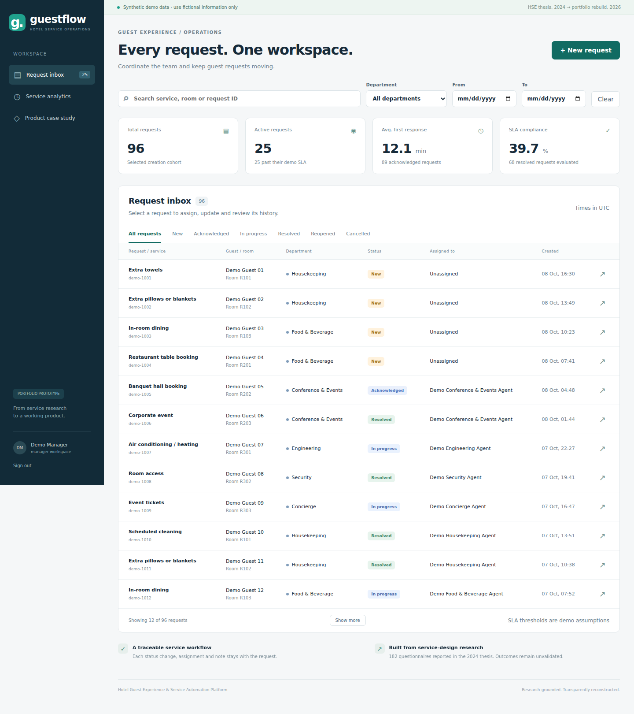
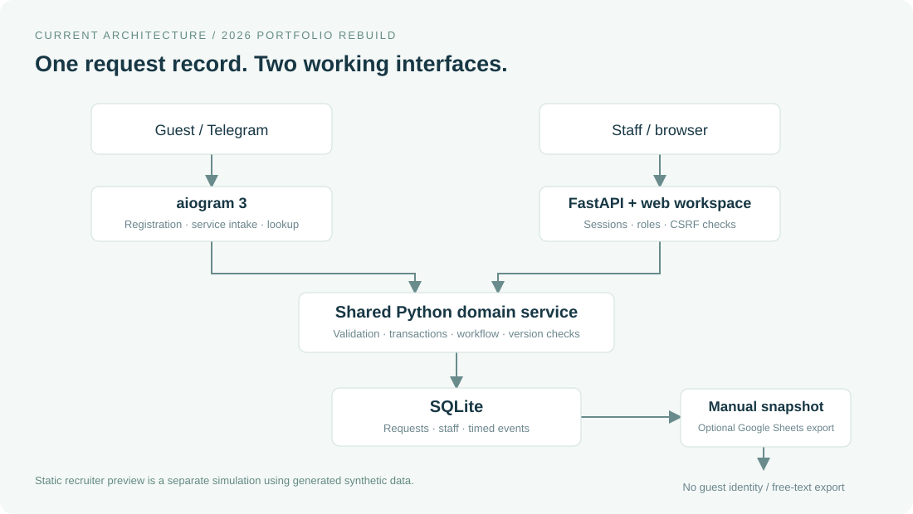
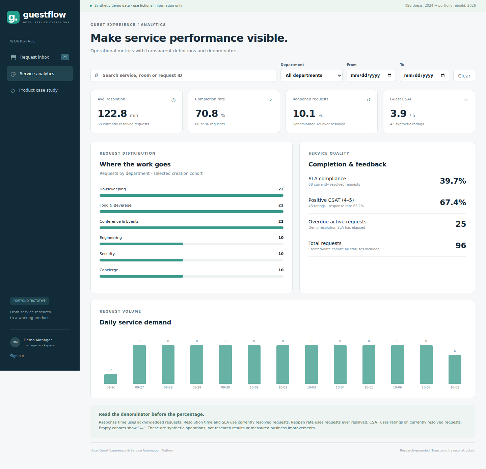

# Hotel Guest Experience & Service Automation Platform

**A research-led hospitality product case: from guest-service problems to requirements, a Telegram bot, a staff workspace and operational analytics.**

Created from Albina Urubkina's 2024 HSE University graduation thesis in Business Informatics, focused on service design at Novotel Moscow. The runnable platform is a **2026 portfolio reconstruction and extension**, not an official Novotel product or a production deployment.

**[Explore the visual product case study](https://alyalbina.github.io/hotel-guest-experience-platform/case-study/)** · **[Try the interactive demo](https://alyalbina.github.io/hotel-guest-experience-platform/demo/)** · [Research sources](docs/research.md) · [PRD](docs/prd.md) · [Business requirements](docs/brd.md) · [Evidence & provenance](docs/provenance.md)

The case study traces guest-service research through product decisions, service/system design and a working prototype. Interactive models, real screenshots and metric definitions are supported by the source documentation. See [case-study validation and sharing copy](docs/case-study-notes.md).

> The live demo is available on GitHub Pages. No Python, account or API key is needed. It uses synthetic data; edits exist only in the current tab and reset on refresh. For an offline preview, download the repository and open **`OPEN_DEMO.html`**.



## Problem Statement

Guest requests arrive through reception visits and room phones. Manual handoffs make it difficult to retain context, assign responsibility and see whether a service was completed. The thesis identifies delays, lost requests, language friction and limited management visibility as service problems (pp. 24–26).

The product question: **how can a guest ask for help with less effort while giving hotel teams one traceable operational record?**

## Product Overview

Guests register and choose services in Telegram. Requests are stored transactionally in SQLite and routed to a department. Staff use a browser workspace to assign an employee, acknowledge work, update status and inspect the event history. Analysts review a defined set of operational metrics, with visible denominators and creation-cohort filters.

There are two demos: an interactive browser-only preview with fictional data, and a local full application with authentication, persistent workflow and an optional Telegram integration.

## My Role & Contributions

**Thesis, 2024 — Albina Urubkina:** guest-experience research, service-design artifacts, stakeholder and process analysis, requirements, system/data-model design and development of the integrated prototype case.

**Portfolio rebuild, 2026:** reconstruction of documented staff workflows, a new web panel, explicit state/event model, analytics definitions, synthetic data, automated checks and English documentation. The implementation was rebuilt with AI engineering assistance. The preserved original bot credits `@d_chistikov`; this repository does not claim sole authorship of the original Python implementation. See [provenance](docs/provenance.md).

## Research & Key Insights

The thesis reports **182 completed questionnaires**, qualitative interviews and online-review analysis. It includes CJM, Affinity Diagram, Fishbone Diagram and Service Blueprint. Reported themes include delayed service, inconsistent communication, lost requests and friction in asking for help.

Raw survey rows, interview transcripts and an independently verifiable sample breakdown are unavailable. Research statements are attributed to the thesis; they are not a fresh validation. Historical NPS, CSAT and CES are documented with their limitations in [research](docs/research.md), separately from synthetic operational metrics.

## Product Discovery

| Insight reported in the thesis | Product decision | Current boundary |
| --- | --- | --- |
| Guests repeat requests when context is lost | Durable request ID and event history | Implemented in the rebuild |
| Manual departmental handoffs obscure ownership | Category routing and employee assignment | Reconstructed workflow; new implementation |
| Reception visits and room-phone friction add effort | Telegram service intake | Original concept, migrated adapter |
| Management lacks operational visibility | Response/resolution, SLA and CSAT dashboard | New module; synthetic data only |

The [CJM](docs/customer-journey.md), [Service Blueprint](docs/service-blueprint.md) and [AS-IS / TO-BE](docs/processes.md) explain the translation from service problems to workflow decisions.

## Business Requirements

Maintain a central request record, preserve responsibility and status, let guests submit structured service requests, and support transparent service-performance review. Requirements are linked to acceptance criteria and verification in the [traceability matrix](docs/requirements.md). CRM/PMS integration, hotel identity verification and automated proactive notifications remain planned.

## System Architecture



The bot and FastAPI API share a Python domain service and the same SQLite file. Guest submissions do not depend on Google Sheets. Sheets export is an optional manual snapshot of operational fields. See [architecture decisions](docs/architecture.md), [UML](docs/uml.md) and [data model](docs/data-model.md).

## Technology Stack

Python 3.11–3.14 · aiogram **3.31.0** · FastAPI · SQLite · HTML/CSS/JavaScript · gspread (optional) · pytest · Playwright · Ruff · GitHub Actions.

The panel needs no Node build, React application, paid API or LLM. A single-language backend is appropriate for a demonstrable small-team prototype. [Migration notes](docs/migration.md) document the move from aiogram 2.25.1.

## Implemented Features

- Guest registration with room and name; optional validated legacy profile fields.
- Nine service categories and 23 service options adapted from the original catalog.
- Durable request IDs, department routing and duplicate-submission protection.
- Staff sign-in, manager/department-agent/analyst permissions and CSRF protection.
- Inbox search; department, status and creation-date filtering.
- Employee assignment; acknowledged, in-progress, resolved, reopened and cancelled states.
- Timestamped event history, conflict detection and reopening reasons.
- Guest status lookup and CSAT submission through Telegram.
- Operational metrics, charts, SQL queries and 96 reproducible synthetic requests.
- Optional Google Sheets operational snapshot, excluding guest identity and free-text detail.

## Screenshots & Demo



[Request history](docs/screenshots/request-history.png) · [Mobile layout](docs/screenshots/mobile.png) · [Product case](docs/screenshots/case-study.png) · [Three-minute demo script](docs/demo-guide.md).

Screenshots are from the actual application. They are not AppSheet screenshots or evidence of business impact.

## Business Impact Hypotheses

Centralized intake may reduce missed requests; clear responsibility may reduce handoff time; persistent status may reduce repeat contacts. None of these effects has been measured in a hotel pilot. The thesis's financial examples are scenarios, not achieved revenue or savings. The [metrics framework](docs/metrics.md) specifies what should be measured before making impact claims.

## Setup Instructions

**Fastest preview:** open `OPEN_DEMO.html` in a modern browser.

**Full application:** install Python 3.12, open a terminal in this folder and run:

```bash
python -m venv .venv
# macOS / Linux:
source .venv/bin/activate
# Windows PowerShell: .venv\Scripts\Activate.ps1
python -m pip install -r requirements.txt
python -m app.cli seed
python -m uvicorn app.web:create_app --factory --host 127.0.0.1 --port 8000
```

Open **http://127.0.0.1:8000**. Demo sign-in: `demo` / `PortfolioDemo2026!`. Read-only: `analyst`; department example: `housekeeping-agent`. All seeded demo accounts use the same demo-only password. Data is fictional and persists locally.

For Telegram, copy `.env.example` to `.env`, enter a **new** BotFather token and run `python -m app.bot` in a second terminal using the same folder/database. Never use credentials from the original archive. The staff panel runs without a bot token. See [setup](docs/setup.md) for Windows steps, private staff setup, Sheets export and troubleshooting.

## Verification

```bash
python -m pip install -r requirements-dev.txt
pytest -q --cov=app
ruff check .
ruff format --check .
python scripts/check_public_tree.py
python -m playwright install chromium
python scripts/browser_smoke.py
python scripts/case_study_smoke.py
```

Tests cover the real aiogram dispatch through an offline transport, validation, atomic persistence, concurrent updates, role boundaries, authentication, CSRF, SQL/Python metric parity and export failure isolation. Local results and untested external integrations are recorded in [validation](docs/validation.md). [GitHub CI](https://github.com/alyalbina/hotel-guest-experience-platform/actions/runs/37847790485) passed on Python 3.11, 3.12 and 3.13, including browser smoke checks and a dependency audit. [Pages deployment](https://github.com/alyalbina/hotel-guest-experience-platform/actions/runs/37847919589) passed. Publication was verified on 8 October 2026 (UTC).

## Limitations & Future Improvements

This is a single-hotel prototype. Room selection is self-reported; it is not hotel check-in verification. Saved requests are durable, but unfinished bot conversations use in-memory FSM state. The browser preview simulates changes and has no real authentication or backend. Google Sheets and live Telegram delivery require new credentials and separate acceptance checks. AppSheet itself is unavailable. No real guest data or original secret-bearing files are included.

Hotel SSO/PMS verification, retention/deletion processes, proactive guest notifications, accessible keyboard focus management, load testing and a controlled service pilot are future work. See [backlog and roadmap](docs/roadmap.md), [security](SECURITY.md) and [audit](docs/audit.md).

## Documentation & Portfolio

[Documentation index](docs/README.md) · [User stories](docs/user-stories.md) · [Metrics & SQL](docs/metrics.md) · [CV / LinkedIn / interview material](docs/portfolio.md) · [Publishing instructions](docs/publishing.md).
