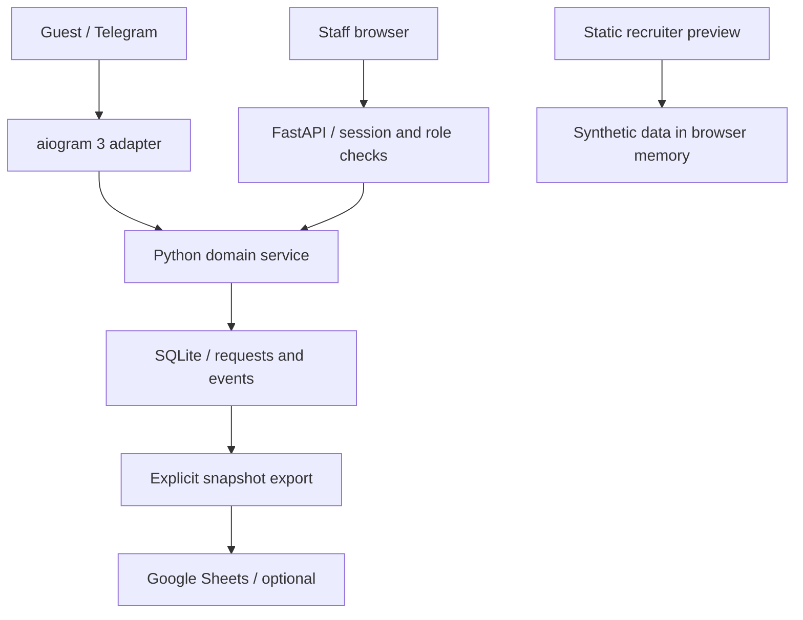

# System architecture and decisions

**Status:** current 2026 implementation, reconstructed from the original product workflow. Original topology: Telegram/aiogram 2 + SQLite → Google Sheets → AppSheet. Current topology removes Sheets from the intake dependency path.

## Components

| Component | Responsibility | Failure boundary |
| --- | --- | --- |
| `app/bot.py` | Telegram FSM, menus, guest commands | No destructive/admin file commands; no synchronous DB calls on event loop |
| `app/web.py` | Session/CSRF/role checks and staff HTTP API | Authentication failure prevents access; server enforces scope |
| `app/service.py` | Validation, transactions, transition rules and conflict handling | Rollback preserves record/event consistency |
| `app/db.py` / schema | Connection lifecycle, FKs, constraints, indexes | Single local SQLite file; write lock serializes mutations |
| `app/analytics.py` | Defined creation-cohort metrics | Empty cohorts return null for rates/means |
| `app/sheets.py` | Optional operational snapshot | Export failure leaves intake and local data intact |
| `app/static` | Browser UI without a build tool | Uses escaped text; API is the authority in full app mode |
| `OPEN_DEMO.html` | Browser-only simulation | No real authentication/persistence; refresh resets changes |

## ADR-01: FastAPI plus a small HTML/JS panel

Streamlit would be fast for an analyst dashboard, but per-request interactions, session/CSRF controls and a polished inbox/drawer flow fit a thin browser UI plus explicit HTTP API better. React would add a separate toolchain without a clear need at this size. One Python backend and build-free frontend keep setup understandable and free. This is a deliberate alternative to both proposed stacks.

## ADR-02: SQLite as the operational source of truth

The original has SQLite plus Sheets, with two non-atomic writes and a sheet-row race. The rebuild commits request and event locally first. Staff and bot share the database on one machine. WAL, busy timeout, FK constraints and short write transactions support the demonstrator. PostgreSQL is future work only if measured concurrency or multiple instances justify it.

## ADR-03: constrained states and optimistic conflicts

Status changes are operations, not arbitrary record edits. `BEGIN IMMEDIATE` plus a version comparison prevents two staff updates from silently overwriting each other. First-response and first-resolution time remain fixed; latest resolution can clear on reopening. Events explain changes. The audit trail is not cryptographically tamper-evident.

## ADR-04: optional manual Sheets export

Preserve integration knowledge without making it a fragile intake dependency. Export a sanitized snapshot to a dedicated tab using gspread's explicit RAW API. Do not synchronize AppSheet edits back into SQLite or call it a full bidirectional migration. Real credentials/access remain unverified.

## ADR-05: two demonstration modes

The full local app demonstrates real persistence, role checks and API behavior. The static preview demonstrates product interaction without keys, Python or server hosting. Sharing the UI reduces visual drift, while Python/SQL tests and browser checks guard calculations/workflows. The preview is plainly labeled as a simulation. `export-demo` regenerates data in an isolated temporary database and never reads operational records.

## Deployment

Run bot and API in the same project folder with the same database path. They may be two processes on one host. Do not deploy multiple independent copies with local files and expect one shared queue. GitHub Pages can host the static preview only; it cannot run the Python API or bot. A real staff deployment requires HTTPS, private accounts, durable storage, backup/retention and guest identity integration.
