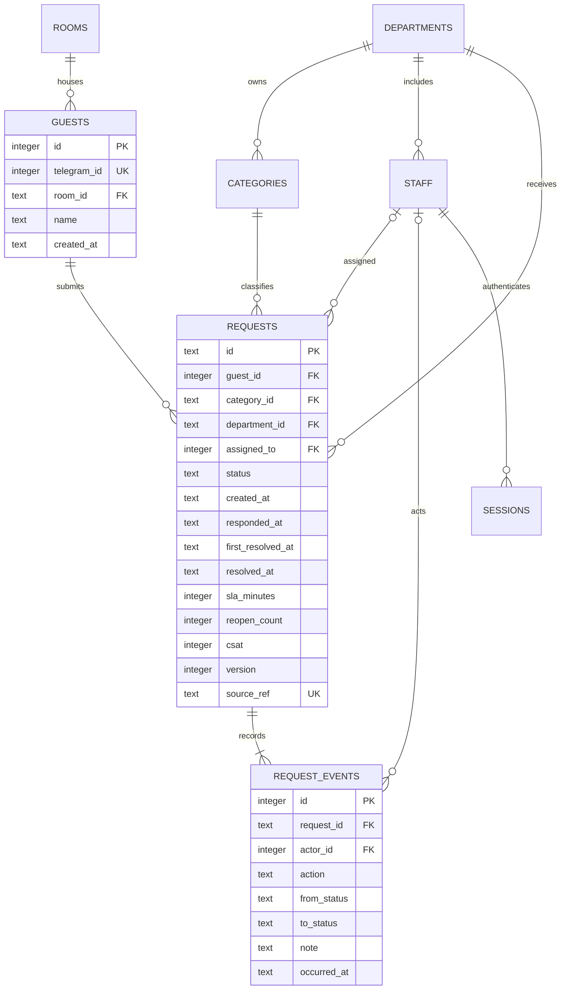

# ERD and data model

## Original logical model

**Source:** visually inspected ERD on T1 p. 64 and entity explanations on pp. 65–68. The diagram contains Room, Guest, Task, TaskCategory, DepartmentHotel, Employee and EmployeeCategory. Task links to guest/category/department. The source drawing uses pending/completed/cancelled, while AppSheet screens discuss complete/incomplete and the bot writes `Incompleted`. This inconsistency is resolved explicitly in the new state machine.

No original SQLite database was provided. The surviving bot's actual schema contains only users/guests/tasks, with denormalized string keys and no declared foreign keys. The thesis's conceptual ERD must not be confused with that physical schema.

## Current physical model

Managers and analysts may have no department; agents require one. Event actor can be null for guest/system events. Nullable Telegram IDs are possible at the schema level, but the current bot populates them and seeded demo guests use negative fictional IDs. A room may have several historical guest records; this is not an occupancy/reservation engine.

## Dictionary and constraints

| Table | Key fields | Rule |
| --- | --- | --- |
| rooms | `id` | Listed demo room identifiers, no availability management |
| departments | `id`, name, `sla_minutes` | Positive demo resolution threshold |
| categories | `id`, name, `department_id` | One default department per category |
| staff | `id`, unique username, role, department, password hash | manager/agent/analyst; agent department required |
| guests | `id`, unique Telegram ID, room, name; optional birthday/gender/email/phone | Minimal default; profile fields are not exported or shown in queue |
| requests | `id`, guest/category/department/assignee, service/detail, state/timestamps, version | Unique source reference; status/rating checks and FKs |
| request_events | request, optional staff actor, action/note/status/time | Append by domain operations; not a tamper-proof ledger |
| sessions | hashed token, staff, CSRF token, expiry | Session lookup checks expiry; logout removes token |
| login_attempts | hashed client and time | Single-instance rate limit; old attempts pruned |
| schema_version | version | Current schema v1; legacy DB is not migrated automatically |

All application timestamps are UTC `YYYY-MM-DDTHH:MM:SSZ`. Response time is set once on staff acknowledgement. First resolution persists across reopenings; current resolution clears. Reopening increments count and clears the current CSAT so an old rating is not attributed to follow-up service. Historical rating events remain.

## Mapping decisions

EmployeeCategory becomes the staff role field rather than a redundant lookup. Original profile fields remain optional for compatibility. The legacy `users` analytics/profile cache is not recreated because guest identity is sufficient for this prototype. New events/sessions/login-attempts support reliability and access control. No actual historic guest rows were migrated; see [migration](migration.md) before handling any private database later.
