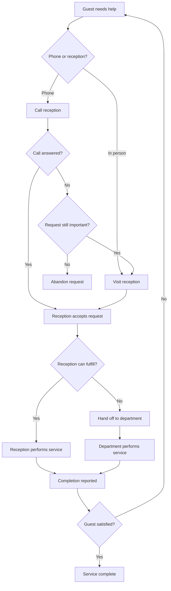
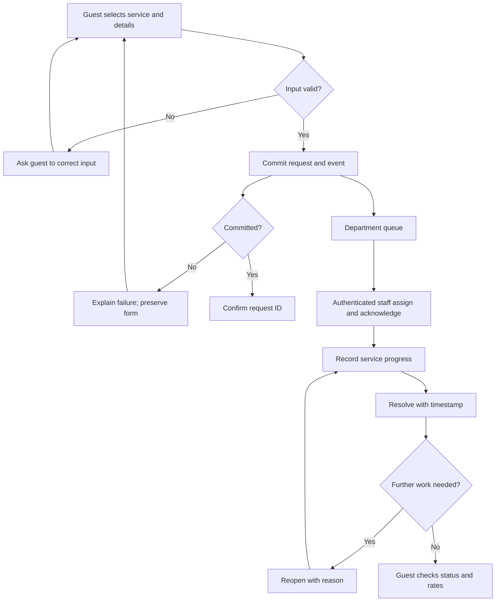

# AS-IS and TO-BE process mapping

**Provenance:** AS-IS is reconstructed from T1 pp. 24–26, including the visually inspected swimlane diagram. Original TO-BE comes from pp. 40–42. The current process includes new reliability/access controls and is labeled separately.

## AS-IS: manual service handling

The model exposes abandonment, repeat contacts and manual responsibility handoffs. It does not establish how often these occurred or the measured time lost.

## Original TO-BE: thesis prototype

Guest registration/intake in Telegram → request record in Google Sheets → AppSheet staff filtering and task detail → staff assignment/status update. The thesis describes guests, rooms, employees, departments and categories. The surviving bot writes requests but does not independently demonstrate staff authentication, automatic guest progress notifications or a working reporting module. AppSheet is unavailable for rerunning.

## Current TO-BE: runnable reconstruction

## Responsibility changes

| Step | AS-IS | Current prototype | Remaining operational work |
| --- | --- | --- | --- |
| Intake | Reception remembers or relays request | Validated structured record | Confirm channel adoption and check-in identity |
| Routing | Staff interpret and find department | Category supplies default department | Hotel approves taxonomy/routing |
| Ownership | Manual handoff | Explicit eligible assignee | Agree shift and escalation procedures |
| Response | Phone/reception interaction | First staff acknowledgement timestamp | Ensure button matches actual human response |
| Completion | Verbal report | Explicit state, event and resolution time | Define fulfillment quality and closure policy |
| Repeat contact | Guest asks again | Staff may reopen with reason | Guests cannot self-reopen in this version |
| Reporting | Incomplete management visibility | Defined cohort metrics | Pilot measurement and data-quality review |

The new platform records state, not physical service execution. A staff click is operational evidence only if staff follow an agreed procedure.
