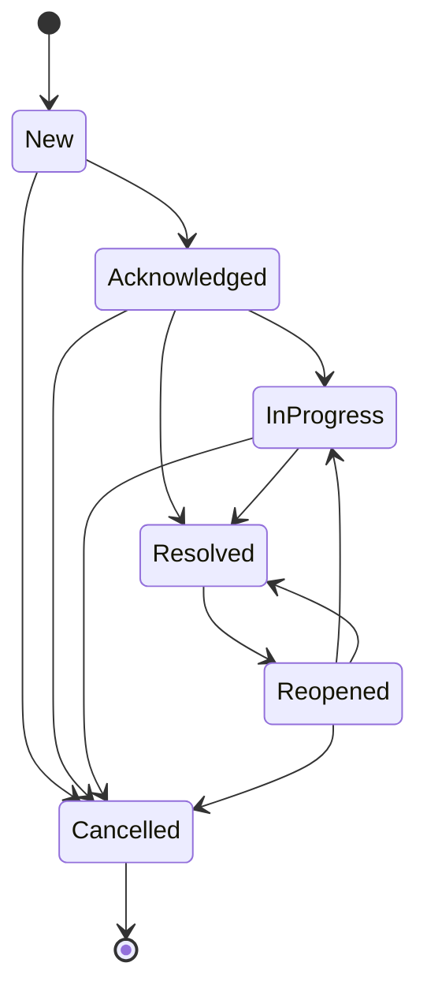
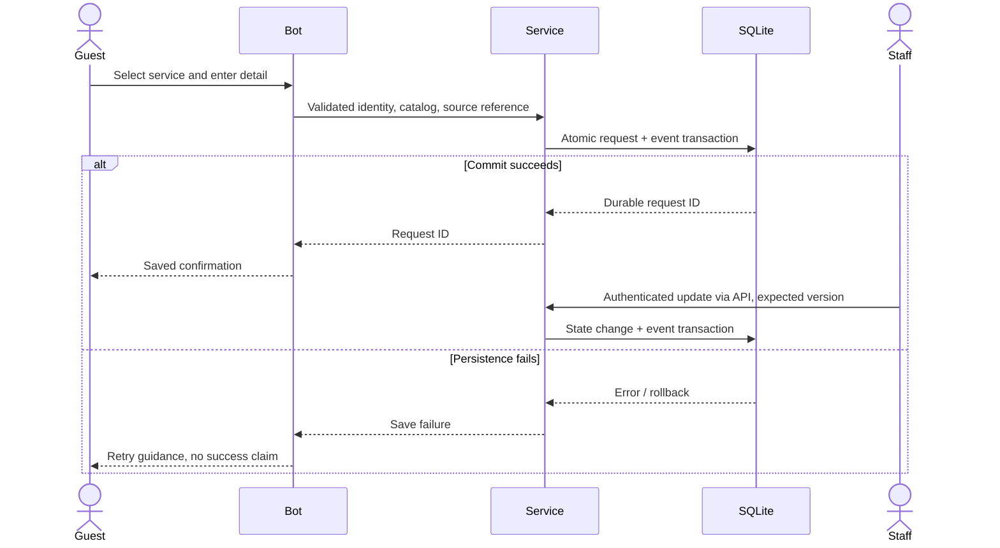
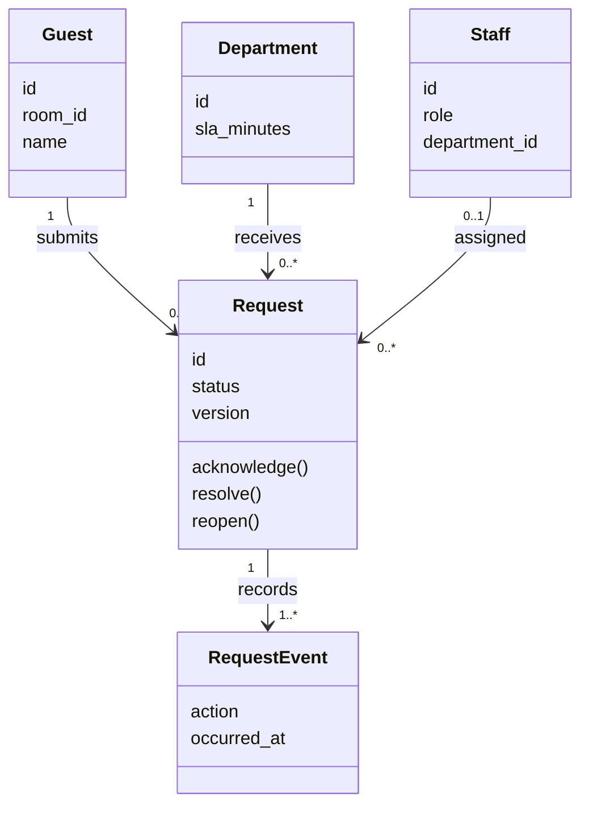

# UML views

The thesis contains use-case, class, activity, sequence, state, component and deployment diagrams (T1 pp. 35–53). The sources below are **new editable diagrams for the reconstructed current system**, not claims that every original diagrammed feature ran in 2024. For the old/current architecture and data-model distinctions, read [provenance](provenance.md) and [data model](data-model.md).

| UML type | Editable standard UML source | Scope |
| --- | --- | --- |
| Use Case | [use-case.puml](diagrams/use-case.puml) | Guest, manager, agent and analyst capabilities |
| Class | [class.puml](diagrams/class.puml) | Logical domain entities, not ORM/Python class declarations |
| Activity | [activity.puml](diagrams/activity.puml) | Validated intake and staff fulfillment |
| Sequence | [sequence.puml](diagrams/sequence.puml) | Save before confirmation, error path and staff update |
| State | [state.puml](diagrams/state.puml) | Enforced lifecycle and reopening |
| Component | [component.puml](diagrams/component.puml) | Bot/API/domain/database/export boundaries |
| Deployment | [deployment.puml](diagrams/deployment.puml) | Two local Python processes and shared SQLite |

PlantUML files are optional documentation; running the product does not require Java or a diagram server. The following Mermaid views are GitHub-readable representations. Flowcharts used for use-case/component topology are **not substituted for formal UML**; formal sources remain above.

## Request lifecycle

Cancelled is terminal. Resolved may reopen, so it is not drawn as an irreversible final state. Reopen/cancel reasons and version checks live in `Service.mutate`.

## Durable intake sequence

Staff → Service is a simplified logical interaction: the full application routes it through FastAPI session/CSRF/role checks. Sheets is absent from this synchronous save sequence by design.

## Logical class relationships

The runnable implementation keeps operations in a single domain service over SQLite rows. These logical methods explain domain behavior; they are not claims that the app has an ORM entity class for each box.
